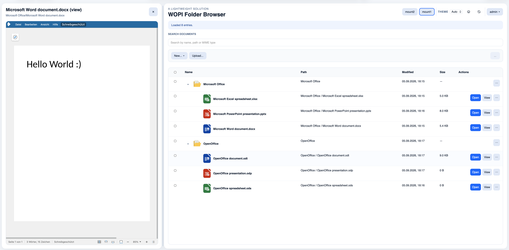
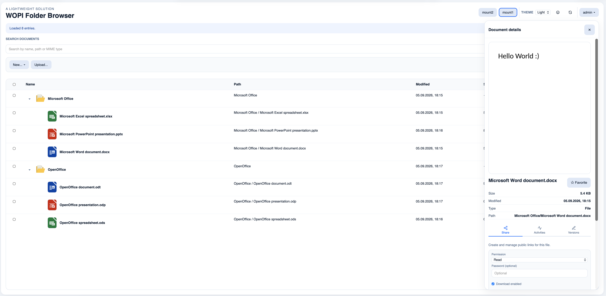
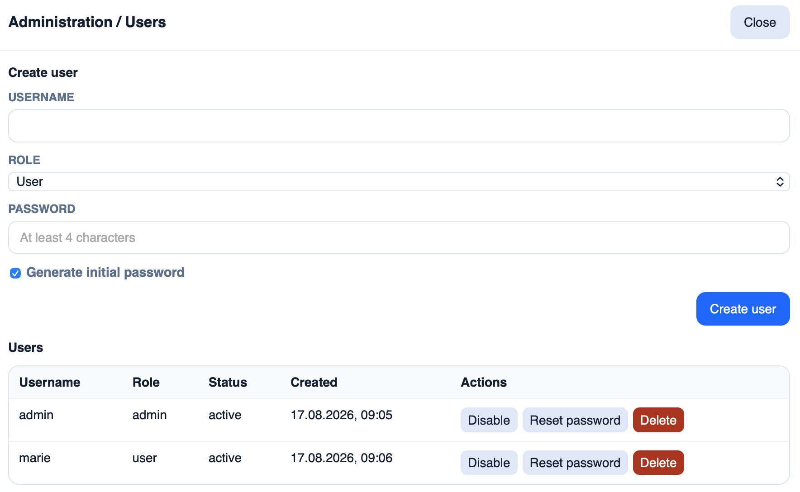

# WOPI Folder Browser

This project is a small WOPI host for Collabora Online CODE. It lists Office files from a mounted folder, opens them in Collabora, and writes saves back into the same folder.

## Easy file browser with document preview
<picture>
  <source media="(prefers-color-scheme: dark)" srcset="screenshot_dark.png">
  <source media="(prefers-color-scheme: light)" srcset="screenshot_light.png">
  
</picture>


## Detailed file view for sharing, activity and document restore
<picture>
  <source media="(prefers-color-scheme: dark)" srcset="screenshot_details_dark.png">
  <source media="(prefers-color-scheme: light)" srcset="screenshot_details_light.png">
  
</picture>


## Runs out-of-box as shared-user and can be used with accounts, also.
<picture>
  <source media="(prefers-color-scheme: dark)" srcset="screenshot_admin_dark.png">
  <source media="(prefers-color-scheme: light)" srcset="screenshot_admin_light.png">
  
</picture>

## Features

- reads supported Office files from a local or mounted folder
- shows a simple browser UI with nested paths
- opens the selected file inside an embedded Collabora iframe
- implements `CheckFileInfo`, `GetFile`, `PutFile`, `WOPI locks`, and `RenameFile`
- supports **Open/Edit/View** launch modes and public share links
- supports creating new text/spreadsheet/presentation files and optional template-based creation
- supports rename/move/copy/delete, favorites, recent files, and version history restore
- supports file uploads into the root folder or a selected folder, including drag-and-drop of files and folders
- supports Office thumbnails in the details panel via Collabora `convert-to` with version-based cache
- supports authentication with session cookies, personal user storage, and admin user management
- exposes feature matrix, diagnostics, and supported-format endpoints
- runs together with a Collabora CODE container via Docker Compose
- **multi-storage support** with local filesystem providers for `documents`, `shared`, and `external` storages
- **per-user document isolation** with separate roots for authenticated users
- **configurable shared storage** with mode control (disabled/auth/readonly/readwrite)
- **external storage ACL** with allowlist-based user access control
- **extensible provider architecture** ready for WebDAV, SMB, S3 in future versions

## Reference analysis (Nextcloud richdocuments)

Reference app: `ref_richdocuments/richdocuments`, version **12.0.0-dev.0** (`appinfo/info.xml`).

The current host exposes `/api/feature-matrix` with a mapped list of features and categories:

1. already provided by Collabora
2. provided by WOPI
3. implemented in this application
4. already provided by existing application components
5. not meaningful / not supported in this sample host

## Supported file types

The app lists common Writer, Calc, and Impress formats such as:

- Writer: `odt`, `doc`, `docx`, `rtf`, `txt`
- Calc: `ods`, `xls`, `xlsx`, `csv`, `tsv`
- Impress: `odp`, `ppt`, `pptx`

Additional extensions can be added in `lib/documentStore.js`.

## Quick start with Docker Compose

The repository includes a ready-to-use local dev layout under `wopi_dev_folder`, but the app itself still expects container-internal paths such as `/documents`, `/shared`, `/external/storage`, and `/var/lib/wopi-state`.

### Local development setup

1. Create the host folders used by the default local setup:

```sh
mkdir -p \
  ./wopi_dev_folder/document-storage \
  ./wopi_dev_folder/shared-storage \
  ./wopi_dev_folder/external-storage \
  ./wopi_dev_folder/wopi-state
```

2. Start the stack in the project root:

```sh
docker compose up --build
```

3. Open `http://localhost:3000`.

4. Create the initial admin account inside the app container:

```sh
docker compose exec app npm run setup:admin -- --username admin --password "ChangeThisNow123!"
```

This command is one-time only. A second run returns an error because setup is already completed.

The browser talks to the app on `localhost:3000`, while Collabora talks to the same app over Docker's internal network using the service name `app:3000`.

This local Compose setup is intentionally plain HTTP end-to-end. Do not enable `ssl.termination=true` unless Collabora is actually behind an HTTPS reverse proxy that terminates TLS.

### Optional custom paths for local development

If you want different host folders, set the variables in a `.env` file next to `docker-compose.yml`:

```sh
# Local dev storage mounts
DOCUMENTS_HOST_PATH=./wopi_dev_folder/document-storage
SHARED_STORAGE_HOST_PATH=./wopi_dev_folder/shared-storage
EXTERNAL_STORAGE_HOST_PATH=./wopi_dev_folder/external-storage
SHARED_STORAGE_MODE=auth
SHARED_STORAGE_ROOT=/shared
WOPI_STATE_ROOT=./wopi_dev_folder/wopi-state
```

## Production setup on a server

For a real host/server deployment, do not rely on the repo-local default folders. Create explicit host paths first, then mount them into the container.

### Required host folders

Example layout on the production server:

```sh
mkdir -p \
  /srv/wopi-folder-browser/document-storage \
  /srv/wopi-folder-browser/shared-storage \
  /srv/wopi-folder-browser/external-storage \
  /srv/wopi-folder-browser/wopi-state \
  /srv/wopi-folder-browser/certs
```

The app container will mount these into:

- `/documents` → `document-storage`
- `/shared` → `shared-storage`
- `/external/storage` → `external-storage`
- `/var/lib/wopi-state` → `wopi-state`

For a TLS-terminating reverse proxy, also place the CA certificate in `/srv/wopi-folder-browser/certs/ca.crt` if your setup uses a self-signed internal CA.

### Example `.env.production`

Use a production env file like this:

```sh
# --- Required runtime settings ---
APP_BASE_URL=https://office.lan
COLLABORA_INTERNAL_URL=https://collabora.lan
COLLABORA_PUBLIC_URL=https://collabora.lan
ACCESS_TOKEN_SECRET=replace-with-a-long-random-secret
SESSION_SECRET=replace-with-a-second-long-random-secret
PASSWORD_MIN_LENGTH=12

# --- Required storage / mount paths ---
DOCUMENTS_HOST_PATH=/srv/wopi-folder-browser/document-storage
SHARED_STORAGE_HOST_PATH=/srv/wopi-folder-browser/shared-storage
EXTERNAL_STORAGE_HOST_PATH=/srv/wopi-folder-browser/external-storage
SHARED_STORAGE_MODE=auth
SHARED_STORAGE_ROOT=/shared
WOPI_STATE_ROOT=/srv/wopi-folder-browser/wopi-state

# --- Optional for external storage ---
EXTERNAL_STORAGE_NAME=External Storage
EXTERNAL_STORAGE_ENABLED=1
EXTERNAL_STORAGE_READ_ONLY=0

# --- Production TLS / certs ---
COLLABORA_CA_CERT_PATH=/srv/wopi-folder-browser/certs/ca.crt
PROXY_NETWORK=proxy
COLLABORA_ADMIN_USER=admin
COLLABORA_ADMIN_PASSWORD=replace-with-a-strong-password
```

Then start the production stack:

```sh
docker compose --env-file .env.production -f docker-compose.prod.yml up --build -d
```

Initialize the admin user:

```sh
docker compose --env-file .env.production -f docker-compose.prod.yml exec app \
  npm run setup:admin -- --username admin --password "ChangeThisNow123!"
```

## Docker run with an existing Collabora container

If Collabora is already running elsewhere (for example, in another container or on another host), you can start the WOPI app as a standalone container with explicit mounts.

```sh
docker run -d \
  --name wopi-folder-browser \
  --network my-collabora-network \
  -p 3000:3000 \
  -e PORT=3000 \
  -e APP_BASE_URL=http://localhost:3000 \
  -e DOCUMENT_ROOT=/documents \
  -e SHARED_STORAGE_MODE=auth \
  -e SHARED_STORAGE_ROOT=/shared \
  -e WOPI_STATE_ROOT=/var/lib/wopi-state \
  -e COLLABORA_INTERNAL_URL=http://collabora:9980 \
  -e COLLABORA_PUBLIC_URL=http://localhost:9980 \
  -e ACCESS_TOKEN_SECRET=replace-with-a-long-random-secret \
  -e SESSION_SECRET=replace-with-a-second-long-random-secret \
  -v /srv/wopi-folder-browser/document-storage:/documents \
  -v /srv/wopi-folder-browser/shared-storage:/shared \
  -v /srv/wopi-folder-browser/external-storage:/external/storage \
  -v /srv/wopi-folder-browser/wopi-state:/var/lib/wopi-state \
  your-image-name:tag
```

Notes:

- If Collabora is not on the same Docker network, replace `http://collabora:9980` with the host or service URL that the app can reach.
- `APP_BASE_URL` should be the public URL the browser and Collabora need to reach the WOPI host.
- `COLLABORA_PUBLIC_URL` is the browser-visible Collabora URL used inside the iframe.

## Environment variable reference

The Compose file already wires the important variables. The repo-local `wopi_dev_folder` is a convenience default only for local development; production deployments should set host paths explicitly in `.env` or Compose.

Use this rule of thumb:

- **Initial**: set once during setup; change only for migration or rotation. These are baseline deployment values.
- **Variable**: intended for operational changes at runtime. These can be adjusted later without changing the underlying deployment layout.

> **Quick distinction:** `Initial` values usually define the filesystem layout, secrets, or fixed network wiring. `Variable` values usually control runtime behavior such as auth mode, write protection, and public URLs.
>
> **Practical rule:** if changing it would require moving folders, rotating secrets, or rethinking the deployment topology, it is usually `Initial`. If it only changes behavior while the same deployment remains in place, it is usually `Variable`.

| Variable | Type | Topic | Purpose | Effect / persistence | Default / example |
| --- | --- | --- | --- | --- | --- |
| `DOCUMENTS_HOST_PATH` | Initial | Storage mounts | Host folder mounted into the app container at `/documents` | Mounts the host folder into the container; no app-side persistence, only the Docker mount configuration and host directory matter. | `./wopi_dev_folder/document-storage` |
| `SHARED_STORAGE_HOST_PATH` | Initial | Storage mounts | Host folder mounted at `/shared` when `SHARED_STORAGE_MODE` is enabled | Mounts the shared root into the container; the real state lives on disk under the host path, not in `storages.json`. | `./wopi_dev_folder/shared-storage` |
| `EXTERNAL_STORAGE_HOST_PATH` | Initial | Storage mounts | Optional host folder mounted at `/external/storage` | Sets the filesystem root for external storage; persistent on disk under the host path. | `./wopi_dev_folder/external-storage` |
| `WOPI_STATE_ROOT` | Initial | Storage mounts | Persistent app state root; `common` and `storages/*` live under it | Defines where the app persists runtime state, including `<WOPI_STATE_ROOT>/common/storages.json`. Changing it requires moving the state directory. | `./wopi_dev_folder/wopi-state` |
| `SHARED_STORAGE_ROOT` | Initial | Storage mounts | Container target path for shared storage | Used by the app as the internal filesystem root for shared storage; not stored in a registry. | `/shared` |
| `SHARED_STORAGE_MODE` | Variable | Shared storage | Shared storage visibility: `disabled`, `auth`, `readonly`, or `readwrite` | Changes runtime access behavior after restart; not persisted in `storages.json` because it is environment-controlled. | `disabled` |
| `EXTERNAL_STORAGE_ENABLED` | Variable | External storage | Enable or disable the external storage | App initializes or skips the external storage accordingly; if set, it overrides the stored `enabled` flag in `storages.json`. | `true` |
| `EXTERNAL_STORAGE_READ_ONLY` | Variable | External storage | Toggle write protection for external storage | Controls the storage's read/write mode at runtime; overrides the persisted `readOnly` value when set. | `false` |
| `EXTERNAL_STORAGE_NAME` | Variable | External storage | Display name shown in the UI | Changes the UI label and is persisted in `<WOPI_STATE_ROOT>/common/storages.json` as the storage `name` when no env override is active. | `External Storage` |
| `APP_BASE_URL` | Variable | WOPI / network | Public base URL the browser and Collabora use to reach the WOPI host | Used for callback URLs and WOPI discovery; not persisted in the storage registry. | `http://app:3000` |
| `COLLABORA_INTERNAL_URL` | Variable | WOPI / network | URL the app container uses to fetch discovery | Used by app-side discovery; no app-persisted value beyond config in the running container. | `http://collabora:9980` |
| `COLLABORA_PUBLIC_URL` | Variable | WOPI / network | Browser-visible Collabora URL used inside the iframe | Used in browser-facing URLs; runtime only, no registry persistence. | `http://localhost:9980` |
| `COLLABORA_CA_CERT_PATH` | Initial | WOPI / network | Host certificate path for trusted TLS connections | Used by the runtime TLS setup; path is part of the deployment layout and should be kept stable. | optional |
| `PROXY_NETWORK` | Initial | WOPI / network | Docker network name used for app/Collabora communication | Affects container networking; fixed deployment topology rather than runtime storage metadata. | `wopi-net` |
| `ACCESS_TOKEN_SECRET` | Initial | Auth | Secret used to sign WOPI access tokens | Secret material used by the app at runtime; rotate carefully because existing tokens become invalid. | `change-me-for-real-usage` |
| `SESSION_SECRET` | Initial | Auth | Secret used to sign browser session cookies | Secret material used by the auth layer; rotating invalidates existing sessions. | `change-me-session-secret` |
| `PASSWORD_MIN_LENGTH` | Variable | Auth | Minimum password length for setup/admin/user password flows | Runtime password policy; stored in config and enforced on password creation. | `12` |
| `COLLABORA_ADMIN_USER` | Initial | Collabora auth | Admin username for Collabora-only admin tasks | Used for Collabora admin integration; part of bootstrap configuration rather than storage metadata. | optional |
| `COLLABORA_ADMIN_PASSWORD` | Variable | Collabora auth | Admin password for Collabora-only admin tasks | Used for configured admin calls at runtime; can be rotated without moving folders. | optional |

> **Important:** Env changes become active only after container restart/redeploy.

## Host-to-container mount mapping

The app itself uses container-internal paths only. Host paths belong in Docker Compose and `.env` files.

```yaml
services:
  app:
   environment:
     DOCUMENT_ROOT: /documents
     SHARED_STORAGE_ROOT: /shared
     WOPI_STATE_ROOT: /var/lib/wopi-state
   volumes:
     - ${DOCUMENTS_HOST_PATH:-./wopi_dev_folder/document-storage}:/documents
     - ${SHARED_STORAGE_HOST_PATH:-./wopi_dev_folder/shared-storage}:/shared
     - ${EXTERNAL_STORAGE_HOST_PATH:-./wopi_dev_folder/external-storage}:/external/storage
     - ${WOPI_STATE_ROOT:-./wopi_dev_folder/wopi-state}:/var/lib/wopi-state
```

This separation keeps the app architecture clean and leaves room for future non-local providers (WebDAV, SMB, S3) without changing the internal container paths.

## `storages.json` and the registry

The app persists storage metadata under the WOPI state directory. The generated registry file is:

```text
<WOPI_STATE_ROOT>/common/storages.json
```

This file is created automatically by the app and contains a `storages` array. Each entry describes one storage with fields such as:

- `id` (`documents`, `shared`, `external`)
- `name`
- `type` (`local` in the current implementation)
- `root`
- `scope` (`user`, `public`, `restricted`)
- `enabled`
- `readOnly`
- `mode` (for `shared` storage)
- `allowedUserIds` (for restricted external storage)

Example structure:

```json
{
  "storages": [
   {
     "id": "documents",
     "name": "Documents",
     "root": "/documents",
     "scope": "user",
     "enabled": true,
     "readOnly": false,
     "system": true
   },
   {
     "id": "shared",
     "name": "Shared",
     "root": "/shared",
     "scope": "public",
     "enabled": true,
     "readOnly": false,
     "mode": "auth",
     "system": false
   }
  ]
}
```

This registry is a runtime state artifact, not source code. It is meant to remember the storage configuration, mount-specific state, and access rules between restarts. If you delete it, the app recreates it on the next startup from the current configuration and environment.

## Multi-Storage Architecture

The app supports multiple local filesystem storages through a provider-based architecture:

### Storage Types

**1. Documents Storage** (`documents`)
- Primary storage for authenticated user documents
- Authenticated users get isolated roots: `/documents/users/<user-id>/`
- Unauthenticated requests use shared root: `/documents/shared` (if `SHARED_STORAGE_MODE` permits)
- Read-write by default (respects per-storage `readOnly` flag)

**2. Shared Storage** (`shared`)
- Optional shared resource controlled by `SHARED_STORAGE_MODE`
- Visibility modes:
  - `disabled` (default): not visible or accessible
  - `auth`: visible only to authenticated users, read-write
  - `readonly`: visible to all (including anonymous), read-only
  - `readwrite`: visible to all (including anonymous), read-write
- Container path: configured via `SHARED_STORAGE_ROOT` environment variable

**3. External Storage** (`external`)
- Optional additional storage
- Access controlled by allowlist (`allowedUserIds`):
  - Empty list: no authenticated user can access
  - Filled list: only listed user IDs can access
  - Unauthenticated users: always denied
- Container path: `/external/storage`
- Managed via admin API: `GET/POST /api/admin/external-acl`

### Per-User Document Isolation

Authenticated users in the `documents` storage are automatically isolated:

```
Host:    /srv/wopi/documents/
         └─ user1/
         └─ user2/

Container: /documents/users/
           └─ <user-id-1>/    (only User 1 sees this content)
           └─ <user-id-2>/    (only User 2 sees this content)
```

This ensures users cannot access each other's files even if they know the path.

### External Storage ACL Management

Manage external storage access restrictions through the admin API:

```bash
# View current ACL
curl http://localhost:3000/api/admin/external-acl

# Restrict to specific users (user IDs, not usernames)
curl -X POST http://localhost:3000/api/admin/external-acl \
  -H "Content-Type: application/json" \
  -d '{"allowedUserIds":["4fcfa85b-ba1f-4040-9b79-4810ee05ab5a","b3f0..."]}'

# Deny all users (empty list)
curl -X POST http://localhost:3000/api/admin/external-acl \
  -H "Content-Type: application/json" \
  -d '{"allowedUserIds":[]}'
```

Requires admin authentication.

Set users step-by-step:

```bash
# 1) Login as admin (stores cookie)
curl -i -c cookies.txt -X POST http://localhost:3000/api/auth/login \
  -H "Content-Type: application/json" \
  -d '{"username":"admin","password":"YOUR_ADMIN_PASSWORD"}'

# 2) List users and copy their "id" values
curl -b cookies.txt http://localhost:3000/api/admin/users

# 3) Set external storage ACL with those ids
curl -b cookies.txt -X POST http://localhost:3000/api/admin/external-acl \
  -H "Content-Type: application/json" \
  -d '{"allowedUserIds":["<user-id-1>","<user-id-2>"]}'

# 4) Verify current ACL
curl -b cookies.txt http://localhost:3000/api/admin/external-acl
```

### Storage Configuration Examples

**Scenario 1: Only authenticated users, personal documents**
> Default setup. Each user has their own document folder. No shared or external storage.

```sh
# .env (or docker-compose environment)
DOCUMENTS_HOST_PATH=/srv/wopi/documents
WOPI_STATE_ROOT=/srv/wopi/state
SHARED_STORAGE_MODE=disabled
```

---

**Scenario 2: Shared team drive (all logged-in users can read and write)**

```sh
DOCUMENTS_HOST_PATH=/srv/wopi/documents
SHARED_STORAGE_HOST_PATH=/srv/wopi/teamdrive
SHARED_STORAGE_ROOT=/shared
SHARED_STORAGE_MODE=auth
WOPI_STATE_ROOT=/srv/wopi/state
```

```yaml
volumes:
  - /srv/wopi/documents:/documents
  - /srv/wopi/teamdrive:/shared
  - /srv/wopi/state:/var/lib/wopi-state
```

---

**Scenario 3: Public read-only library (anyone can browse, nobody can upload)**

```sh
SHARED_STORAGE_HOST_PATH=/srv/wopi/library
SHARED_STORAGE_ROOT=/shared
SHARED_STORAGE_MODE=readonly
```

---

**Scenario 4: Personal documents + NAS mount for selected users**

```sh
DOCUMENTS_HOST_PATH=/srv/wopi/documents
EXTERNAL_STORAGE_HOST_PATH=/mnt/nas/office
WOPI_STATE_ROOT=/srv/wopi/state
SHARED_STORAGE_MODE=disabled
```

After startup, restrict external storage to specific users via admin API:

```bash
curl -X POST http://localhost:3000/api/admin/external-acl \
  -H "Content-Type: application/json" \
  -d '{"allowedUserIds":["<user-id-1>","<user-id-2>"]}'
```

---

**Scenario 5: Full setup — personal + shared team drive + NAS mount**

```sh
DOCUMENTS_HOST_PATH=/srv/wopi/documents
SHARED_STORAGE_HOST_PATH=/srv/wopi/shared
SHARED_STORAGE_ROOT=/shared
SHARED_STORAGE_MODE=auth
EXTERNAL_STORAGE_HOST_PATH=/mnt/nas/office
WOPI_STATE_ROOT=/srv/wopi/state
```

```yaml
volumes:
  - /srv/wopi/documents:/documents
  - /srv/wopi/shared:/shared
  - /mnt/nas/office:/external/storage
  - /srv/wopi/state:/var/lib/wopi-state
environment:
  SHARED_STORAGE_MODE: auth
  SHARED_STORAGE_ROOT: /shared
```

### Host-to-Container Path Mapping

```yaml
services:
  app:
    volumes:
      - ${DOCUMENTS_HOST_PATH:-./wopi_dev_folder/document-storage}:/documents
      - ${EXTERNAL_STORAGE_HOST_PATH:-./wopi_dev_folder/external-storage}:/external/storage
      - ${SHARED_STORAGE_HOST_PATH:-./wopi_dev_folder/shared-storage}:/shared
      - ${WOPI_STATE_ROOT:-./wopi_dev_folder/wopi-state}:/var/lib/wopi-state
    environment:
      SHARED_STORAGE_MODE: auth
      SHARED_STORAGE_ROOT: /shared
```

Environment variables (`.env`):

```sh
DOCUMENTS_HOST_PATH=./wopi_dev_folder/document-storage
EXTERNAL_STORAGE_HOST_PATH=./wopi_dev_folder/external-storage
SHARED_STORAGE_HOST_PATH=./wopi_dev_folder/shared-storage
SHARED_STORAGE_MODE=auth
SHARED_STORAGE_ROOT=/shared
WOPI_STATE_ROOT=./wopi_dev_folder/wopi-state
```

**Important**: The app only knows container-internal paths (`/documents`, `/shared`, `/external/storage`). Host paths belong exclusively in Docker Compose and `.env` files. This separation enables future non-local providers (WebDAV, SMB, S3) without architectural changes.

| Variable | Purpose | Default |
| --- | --- | --- |
| `MAX_DOCUMENT_SIZE` | Raw upload limit for `PutFile` | `100mb` |
| `TEMPLATE_ROOT` | Template root folder for personal/group/global/admin templates | `<DOCUMENT_ROOT>/.templates` |
| `DEFAULT_EDITOR_MODE` | Launch mode for Open action (`edit`/`view`) | `edit` |
| `ALLOW_DOCUMENT_CREATION` | Enables/disables API creation endpoints | `1` |
| `ALLOW_TEMPLATES` | Enables/disables template endpoints | `1` |
| `ALLOW_PDF_EXPORT` | Feature flag for PDF export integration hooks | `1` |
| `ALLOW_PUBLIC_EDITING` | Enables/disables edit-capable public links | `1` |
| `PREVIEW_GENERATION` | Feature flag for preview generation hooks | `1` |
| `THUMBNAIL_MAX_WIDTH` | Maximum thumbnail width in pixels | `1024` |
| `THUMBNAIL_MAX_HEIGHT` | Maximum thumbnail height in pixels | `1024` |
| `THUMBNAIL_RETRY_COUNT` | Conversion retry attempts for temporary failures | `3` |
| `THUMBNAIL_RETRY_DELAY_MS` | Delay between conversion retries in ms | `300` |
| `THUMBNAIL_REQUEST_TIMEOUT_MS` | Timeout for capabilities/convert requests in ms | `15000` |
| `THUMBNAIL_TOKEN_TTL_MS` | Read-only WOPI token lifetime for thumbnail requests in ms | `60000` |
| `THUMBNAIL_DEBUG` | Enables detailed thumbnail debug logs in backend and details-preview flow | `0` |
| `DEFAULT_TEXT_DOCUMENT_NAME` | Default localized base name for new text docs | `Untitled document` |
| `DEFAULT_SPREADSHEET_NAME` | Default localized base name for new spreadsheets | `Untitled spreadsheet` |
| `DEFAULT_PRESENTATION_NAME` | Default localized base name for new presentations | `Untitled presentation` |

Thumbnail conversion targets Collabora on `POST /cool/convert-to/png`. The service first tries a WOPI-based convert request and automatically falls back to multipart upload when the Collabora instance rejects WOPI convert payloads.

## Running without Docker

```sh
npm install
npm start
```

Useful environment variables:

```sh
PORT=3000
DOCUMENT_ROOT=./wopi_dev_folder/document-storage
APP_BASE_URL=http://localhost:3000
COLLABORA_INTERNAL_URL=http://localhost:9980
COLLABORA_PUBLIC_URL=http://localhost:9980
ACCESS_TOKEN_SECRET=change-me
SESSION_SECRET=change-me-session
PASSWORD_MIN_LENGTH=12
THUMBNAIL_DEBUG=0
```

## Production setup: `office.lan` + `collabora.lan`

Use `docker-compose.prod.yml` when:

- the WOPI app is published as `https://office.lan`
- Collabora CODE is published as `https://collabora.lan`
- Collabora itself runs on plain HTTP in the container
- a reverse proxy terminates TLS in front of Collabora
- the certificate for `collabora.lan` is signed by your own CA and you have the matching `ca.crt`

### Files

- `docker-compose.prod.yml`: production-oriented Compose example
- `.env.production.example`: required environment variables

### App container settings

Set the WOPI app so it talks to the public HTTPS Collabora URL:

| Variable | Value for this setup | Why |
| --- | --- | --- |
| `APP_BASE_URL` | `https://office.lan` | This becomes the `WOPISrc` base URL used by Collabora callbacks. |
| `COLLABORA_INTERNAL_URL` | `https://collabora.lan` | The app fetches `/hosting/discovery` from this address. |
| `COLLABORA_PUBLIC_URL` | `https://collabora.lan` | The browser opens the editor iframe on this public URL. |
| `NODE_EXTRA_CA_CERTS` | `/run/certs/collabora-ca.crt` | Lets Node trust your self-signed CA for outbound HTTPS to Collabora. |

Mount the CA file read-only into the app container:

```yaml
volumes:
  - /path/to/ca.crt:/run/certs/collabora-ca.crt:ro
```

`ca.crt` must be the CA certificate that signed the reverse proxy certificate presented by `collabora.lan`.

### Collabora container settings

For Collabora behind a TLS-terminating reverse proxy, the container must be configured for **HTTP internally** and **HTTPS externally**:

| Setting | Required value | Why |
| --- | --- | --- |
| `aliasgroup1` | `https://office\\.lan` | Allows your WOPI host. Use the exact external scheme and host; include `:PORT` if you publish on a non-standard port. |
| `--o:ssl.enable=false` | enabled in `extra_params` | Collabora should not speak TLS itself when the proxy terminates TLS. |
| `--o:ssl.termination=true` | enabled in `extra_params` | Tells Collabora that the public entrypoint is HTTPS behind a proxy. |
| `--o:server_name=collabora.lan` | enabled in `extra_params` | Makes Collabora use the public hostname consistently behind the proxy. |
| `username` / `password` | set strong values | Protects the admin console. |

The example in `docker-compose.prod.yml` is:

```yaml
environment:
  aliasgroup1: https://office\\.lan
  extra_params: >-
    --o:ssl.enable=false
    --o:ssl.termination=true
    --o:welcome.enable=false
    --o:server_name=collabora.lan
```

### Reverse proxy requirements for `collabora.lan`

Your proxy in front of the Collabora container must:

1. forward all Collabora paths to container port `9980`
2. preserve the `Host` header as `collabora.lan`
3. send `X-Forwarded-Proto: https`
4. support WebSocket upgrade requests
5. allow larger request bodies and disable overly aggressive buffering/timeouts for long editing sessions

In practice this means the proxy must correctly handle normal HTTP requests **and** WebSocket traffic for paths under `/cool/`, plus discovery endpoints like `/hosting/discovery`.

### Reverse proxy requirements for `office.lan`

If the WOPI app is also behind HTTPS, the proxy in front of `office.lan` must:

1. publish the app as `https://office.lan`
2. pass requests to the app container on port `3000`
3. preserve the external host so `APP_BASE_URL=https://office.lan` stays valid
4. allow Collabora to call back to `https://office.lan/wopi/...`

### Compose workflow

1. Copy the example env file and adjust the paths and secrets:

   ```sh
   cp .env.production.example .env.production
   ```

2. Ensure your reverse proxy can resolve and reach the `collabora` and `app` services on the external Docker network named in `PROXY_NETWORK`.
3. Ensure the same DNS names used publicly are resolvable from the containers, especially `collabora.lan`.
4. Start the stack:

   ```sh
   docker compose --env-file .env.production -f docker-compose.prod.yml up --build -d
   ```

### What must be configured on the Collabora container?

At minimum:

1. `aliasgroup1` for the exact external WOPI host, here `https://office.lan`
2. `ssl.enable=false` because TLS ends at the proxy
3. `ssl.termination=true` because the public URL is HTTPS
4. `server_name=collabora.lan` so generated public URLs match the proxy hostname
5. strong admin credentials
6. placement on the same Docker network as the reverse proxy

If one of these points is wrong, the common symptoms are:

- **Unauthorized WOPI host**: `aliasgroup*` does not match the WOPI host exactly
- **Socket/WebSocket connection errors**: proxy upgrade headers or `ssl.termination` are wrong
- **TLS/certificate errors from the app**: the app container does not trust the CA for `collabora.lan`

## Notes

- The app keeps a public shared area and additionally supports authenticated personal user storage.
- In production, run both services behind HTTPS and replace the development token secret.
